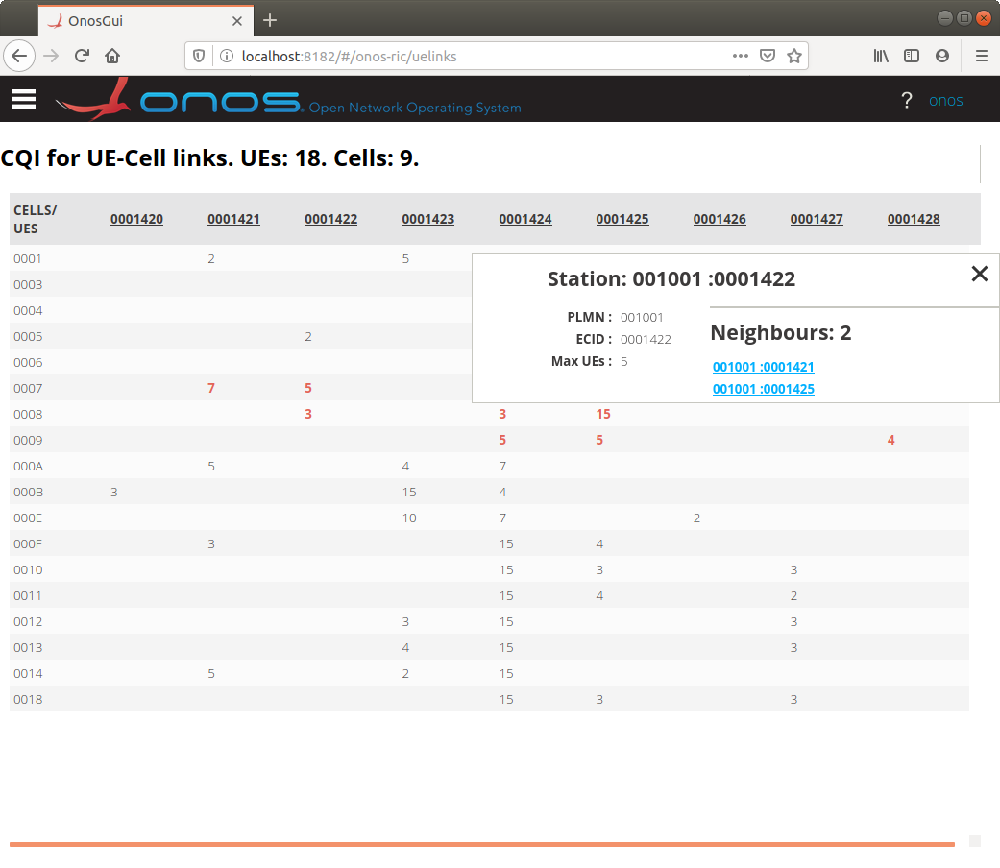
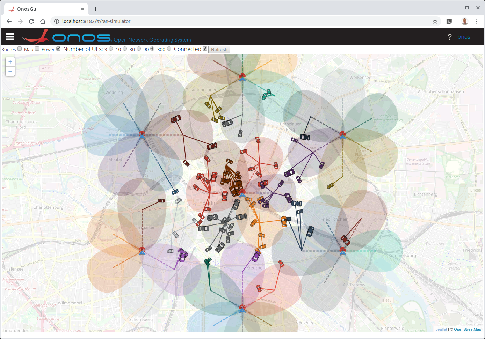

# RAN GUI
The RAN GUI demonstrates the `onos-ric` micro-service and the accompanying `ran-simulator`.

## UELinks View
The **UELinks** view shows the affinity of a User Equipment device (mobile phone)
to cell towers in the network. It presents a tabular layout with Cell Towers
across the top and UEs in the rows. The values shown are Call Quality Indicators (CQIs)
and vary as the UE's move around between towers.

## Map view
The **Map view** shows all of the towers and UEs in teh simulator located on a
Map.

Each tower has a circle around it indicating its power setting. This too can be
turned on or off. Each tower has a different color circle.

The UE travels along a route, and the color of the UE matches the tower it is
connected to. If a UE is handed over to a different tower, it increases momentarily
in size and changes to the color of the new serving tower. 

The routes that the UEs can take can be seen as dashed lines (and can be turned
on and off). The color of the route matched the UE.

A line connects each UE to its **serving tower**. The color of the line changes   
depending on the tower.

The number of UEs can be varied by clicking the readio buttons at the top. The
minimum and maximum values are set through the startup parameters of the 
`ran-simulator` - see [ran-simulator/docs/README.md](https://github.com/onosproject/ran-simulator/blob/master/docs/README.md) 

