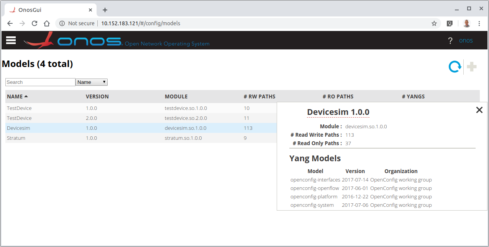

# Running onos-gui

onos-gui can only be run in a Kubernetes cluster. Use the [Helm chart](./deployment.md) to load it.

## Browser access
When deployed, the onos-gui is available to a browser at 
[http://onos-gui](http://onos-gui) (or with a specific port number if port-forwarding or an ingress
is involved).

> Using the hostname **onos-gui** is mandatory - an IP address will not suffice.
> This means that you may have to add an entry to your `/etc/hosts` file if the
> name is not configured on a DNS server. e.g. onos-gui can be added to 127.0.0.1

A simple way to connect to a local pod (e.g. running on KinD) is to use port-forwarding
in a separate terminal:
```bash
kubectl -n micro-onos port-forward $(kubectl -n micro-onos get pods -l type=gui -o name) 8181:80
```
which should make the GUI available at [http://onos-gui:8181](http://onos-gui:8181)

> The port-forward command can be given with `--address=<interfaceip>` matching
> the entry in `/etc/hosts` if the GUI needs to be accessible outside the machine.

The browser connects to onos-gui over HTTP 1.1 to retrieve the Angular compiled
static files.

When the **List onos-config capabilities** button is pressed:

1. A grpc-web request is formed and sent as a POST to [http://onos-gui/gnmi.gNMI/Capabilities](http://onos-gui/gnmi.gNMI/Capabilities)
1. This is forwarded by a `proxy_pass` declaration in `nginx.conf` to [http://onos-config-envoy:8080](http://onos-config-envoy:8080)
1. This is converted in to a gRPC request by Envoy Proxy server's grpc-web filter
1. and is forwarded to [https://onos-config:5150](https://onos-config:5150) as a gRPC request
1. onos-config sends back the response to envoy asynchronously as a gRPC response
1. Envoy's grpc-web service turns it in to a grpc-web response and sends it back to nginx
1. nginx sends the response back to the browser and the callback function is called
1. Inside the browser the callback updates the `capabilities` object inside the AppComponent
1. the binding in the app.component.html page is alerted to the updated value and refreshes the display

## Developer mode
To run the GUI locally on a development machine

- install the prerequisites as described in [prerequisites.md](prerequisites.md)
- run ONIT in Kubernetes as above
- do not do the port forwarding above - instead forward the ports of the envoy proxy
in 2 separate terminals
```bash
kubectl -n micro-onos port-forward $(kubectl -n micro-onos get pods -l type=gui -o name) 8080:8080
kubectl -n micro-onos port-forward $(kubectl -n micro-onos get pods -l type=gui -o name) 8181:8181
```

- run the Angular CLI in `ng serve --configuration=kind` mode from the web/onos-gui folder
- browse to [http://localhost:4200](http://localhost:4200) - this does not require `onos-gui` hostname.
- ensure that the models page shows the 4 loaded model plugins (this
ensures that the gRPC requests are proxied correctly through the envoy proxy)



